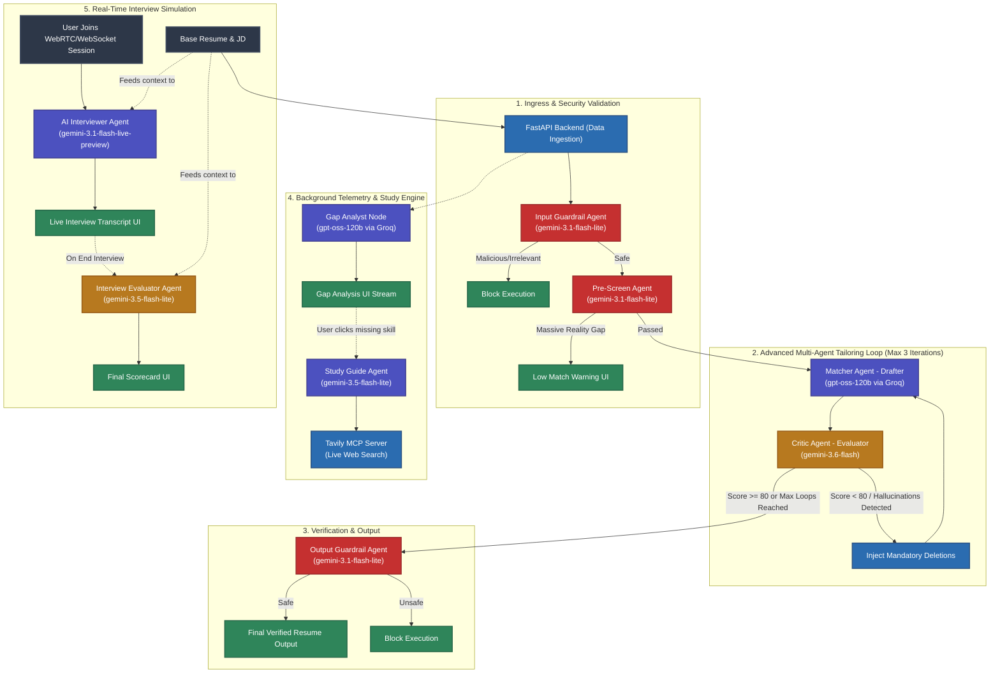
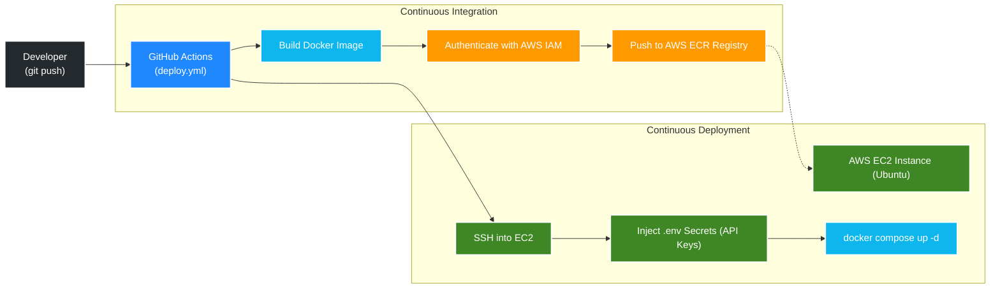

# ResuMatch: Autonomous Career Engineering Engine


An enterprise-grade, multi-agent AI application designed to autonomously tailor resumes to specific job descriptions with a strict **Zero-Hallucination Policy**, alongside a real-time AI mock interview simulation platform.

---

## 🏗️ System Architecture Flowchart

Below is the deep architectural flow of the ResuMatch platform. Unlike standard monolithic LLM wrappers, this system utilizes a **Multi-Model, Multi-Agent Orchestration Engine**, routing specific tasks to the LLM best suited for the job (Groq LLaMA for high-speed drafting, Gemini Flash for strict critical evaluation and real-time voice).



---

## 🤖 Deep Dive: Models & Agents

The architecture deliberately distributes workloads across multiple specific models to balance speed, reasoning capability, and cost:

### 1. Security & Guardrails (`gemini-3.1-flash-lite`)
- **InputGuardrailAgent:** Inspects initial inputs for prompt injections or garbage text.
- **PreScreenAgent:** Does the initial math to ensure the candidate has a realistic chance at the job (e.g., catching a 1-year junior applying for an 8-year senior role).
- **OutputGuardrailAgent:** Scans the final generated resume to ensure no AI meta-text (like `<scratchpad>`) or hallucinated credentials leaked through.

### 2. The Core Drafting Engine (`gpt-oss-120b` via Groq)
- **MatcherAgent:** The workhorse of the application. Driven by the Groq LPU inference engine for extreme speed, this agent maps the candidate's existing factual experience to the target Job Description keywords.
- **GapAnalystAgent:** Runs in parallel to calculate the exact missing skills between the candidate and the JD.

### 3. The Strict Evaluator (`gemini-3.6-flash`)
- **CriticAgent:** Uses Google's highly capable 3.6 Flash model to act as a ruthless grader. It scores the Matcher's draft out of 100. If the score is below 80, or if it detects *any* hallucination/AI "fluff", it forces the Matcher to retry via strict `mandatory_deletions` arrays. (It is mathematically near-impossible to score a perfect 100 without hallucinating, so the target threshold is a highly rigorous 80+).

### 4. Interactive Agents
- **InterviewerAgent (`gemini-3.1-flash-live-preview`):** Powers the mock interview. Driven by the new Gemini Live API (Bidi/WebRTC), this agent has a dynamic voice conversation with the user. **Note:** It explicitly uses the user's *original Base Resume and JD* as its context (not the drafted resume) to test the candidate's actual authentic knowledge.
- **InterviewEvaluatorAgent (`gemini-3.5-flash-lite`):** Acts as a Senior Technical Recruiter at the end of the simulation. It analyzes the complete live transcript against the JD and Resume to calculate a final score out of 100 and provide constructive feedback on strengths and weaknesses.
- **StudyAgent (`gemini-3.5-flash-lite` + MCP):** Generates instantaneous study guides when a user clicks on a missing skill in their Gap Analysis. It connects to a **Tavily MCP Server** over the Model Context Protocol to execute live web searches and fetch up-to-date documentation for the requested skill.

---

## 🚀 Local Development Setup

To run this application on your local machine:

1. **Clone the repository:**
   ```bash
   git clone https://github.com/Sid1396-byte/agentic-resume-interviewer.git
   cd agentic-resume-interviewer
   ```

2. **Create a virtual environment:**
   ```bash
   python -m venv venv
   source venv/bin/activate  # On Windows: venv\Scripts\activate
   ```

3. **Install dependencies:**
   ```bash
   pip install -r requirements.txt
   ```

4. **Set up Environment Variables:**
   Create a `.env` file in the root directory and add your API keys:
   ```env
   GEMINI_API_KEY=your_gemini_key_here
   TAVILY_API_KEY=your_tavily_key_here
   GROQ_API_KEY=your_groq_key_here
   ```

5. **Run the server:**
   ```bash
   uvicorn app:app --reload --port 8080
   ```
   *Navigate to `http://localhost:8080` in your browser.*

---

## ☁️ AWS Production Deployment Guide

This repository includes a fully automated CI/CD pipeline (`.github/workflows/deploy.yml`) that pushes your code to an AWS EC2 instance anytime you commit to the `main` branch. 

### CI/CD & Docker Deployment Architecture


To recreate the production environment from scratch, follow these exact steps:

### Phase 1: AWS Infrastructure Setup
1. **Create the ECR Registry:**
   - Go to AWS Elastic Container Registry (ECR).
   - Create a Private repository named exactly: `resume-tailor`.
2. **Launch the EC2 Web Server:**
   - Launch an **Ubuntu** EC2 instance (t2.micro or t3.micro is sufficient).
   - Allocate **15GB - 20GB** of EBS storage.
   - Under Network Settings, ensure **Allow SSH (22)** and **Allow HTTP (80)** are checked.
   - Create and download a new Key Pair `.pem` file.

### Phase 2: IAM Security Configuration
1. Go to AWS IAM -> **Users** -> Create a new user (e.g., `github-actions-bot`).
2. Attach the policy: `AmazonEC2ContainerRegistryPowerUser` directly to the user.
3. Generate an **Access Key ID** and **Secret Access Key** for this user.

### Phase 3: GitHub CI/CD Configuration
In your GitHub repository, navigate to **Settings -> Secrets and variables -> Actions** and add the following repository secrets:

- `AWS_ACCESS_KEY_ID` *(From IAM Phase 2)*
- `AWS_SECRET_ACCESS_KEY` *(From IAM Phase 2)*
- `AWS_REGION` *(e.g., ap-south-1)*
- `EC2_HOST` *(The Public IPv4 DNS of your EC2 instance)*
- `EC2_SSH_KEY` *(The entire raw text inside your downloaded `.pem` file)*
- `GEMINI_API_KEY` *(Your Gemini API Key)*
- `TAVILY_API_KEY` *(Your Tavily API Key)*
- `GROQ_API_KEY` *(Your Groq API Key)*

### Phase 4: Deploy
Simply commit and push your code to the `main` branch. 
GitHub Actions will automatically SSH into your EC2 instance, install Docker (if missing), inject your secrets into a secure `.env` file, pull the latest image from ECR, and orchestrate the container via `docker-compose`.
